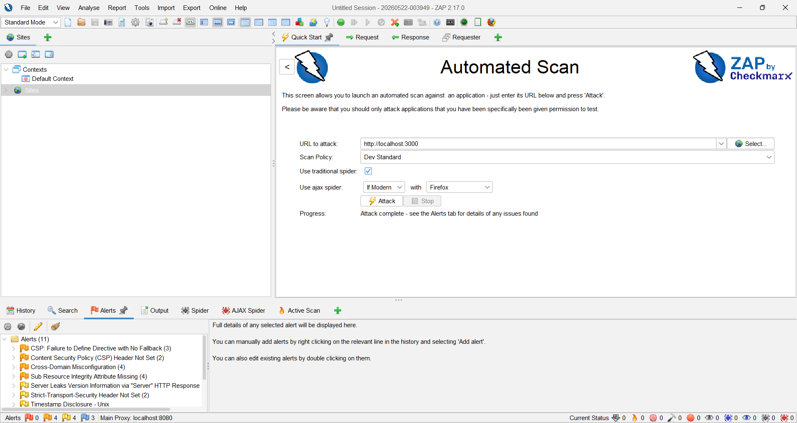

# Laporan DAST dan Manual Testing Minggu 3

## Target Pengujian
http://localhost:3000

## Tool yang Digunakan
- Browser
- Browser DevTools
- Manual Testing
- OWASP ZAP

## Hasil Manual Testing

| ID | Kategori | Pengujian | Expected Result | Status |
|---|---|---|---|---|
| DAST-001 | Session Management | Akses /api/auth/profile tanpa login | Sistem menolak akses | Pass |
| DAST-002 | Authorization / RBAC | User biasa akses /api/auth/admin-dashboard | Sistem mengembalikan akses ditolak / 403 | Pass |
| DAST-003 | Input Validation | Register username dengan script tag | Sistem menolak input | Pass |
| DAST-004 | Password Policy | Register password terlalu pendek | Sistem menolak input | Pass |
| DAST-005 | Authentication | Login salah lebih dari 5 kali | Sistem mengembalikan 429 Too Many Requests | Pass |
| DAST-006 | Cookie Security | Cek cookie token setelah login | Cookie menggunakan HttpOnly dan SameSite Strict | Pass |

## Bukti Screenshot
Screenshot pengujian disimpan sebagai lampiran laporan:
1. Akses endpoint protected tanpa login ditolak.
2. User biasa ditolak saat akses admin dashboard.
3. Input username berbahaya ditolak.
4. Password pendek ditolak.
5. Rate limiter aktif setelah login gagal berulang.
6. Cookie token menggunakan HttpOnly.

## Hasil OWASP ZAP

OWASP ZAP digunakan untuk melakukan automated scan terhadap target `http://localhost:3000`.

Hasil scan menunjukkan terdapat beberapa alert keamanan, antara lain:
- Content Security Policy Header Not Set
- Cross-Domain Misconfiguration
- Sub Resource Integrity Attribute Missing
- Server Leaks Version Information
- Strict-Transport-Security Header Not Set
- Timestamp Disclosure

Laporan hasil scan OWASP ZAP disimpan pada file:

`docs/minggu3/zap-report.html`

